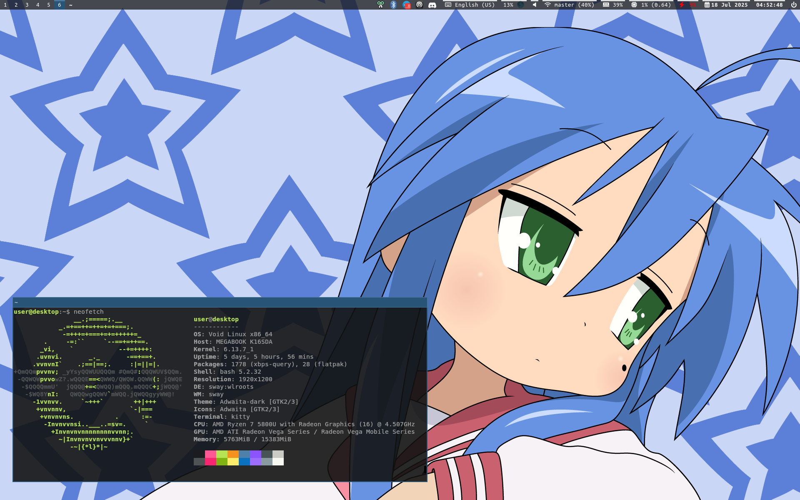

# My config files

I dont use any program for "dotfiles generating", maybe in another life

## About

### Summary



Void Linux + Sway

## How to install

```bash
./install.sh # install packages and configs
```

### About applying

My username is `user`, so if you want to use my configs with another username, you need to change it from `user` to yours here:
```
lightdm/lightdm-mini-greeter.conf (line: 7)
```

Also if you need to use touchpad, edit identifier of it in sway's config (you can find identifier of your touchpad in `swaymsg -t get_inputs`):
```
sway/config (line: 52)
```

Shortcut to change keyboard layout is located here (default: alt + capslock):
```
sway/config (line: 64)
```
